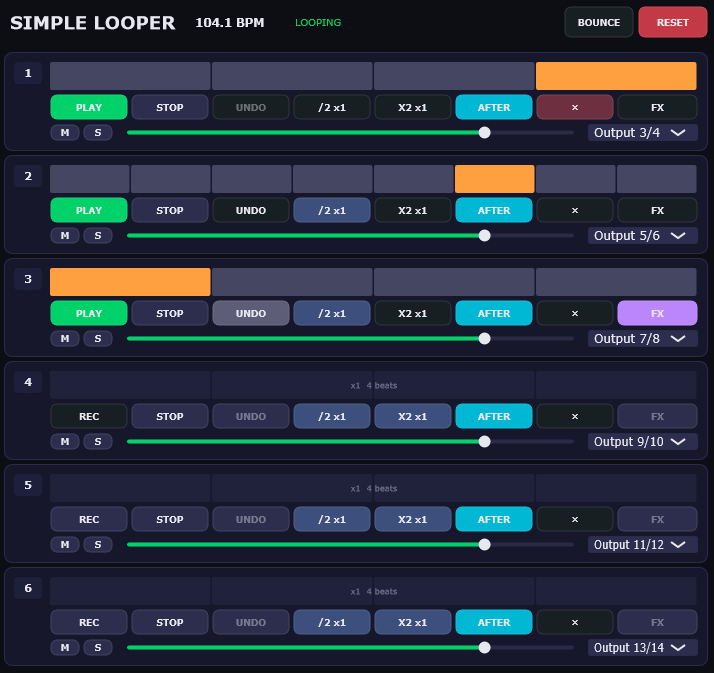

# SimpleLooper

A multi-track looper audio plugin built with [JUCE](https://juce.com/), available as **Standalone** and **VST3**.

## Features

- **6 independent loop tracks** with individual state machines (Record → Play → Overdub → Stop)
- **Overdubbing** — layer new audio on top of existing loops
- **Multiply / Divide** — double or halve loop length per track
- **Undo** — revert the last overdub or edit
- **Mute / Solo** per track
- **Per-track volume** control
- **After Loop (Retrospective Record)** — capture audio that was playing *before* you hit record
- **Bounce Back** — mix down all tracks into a single loop
- **FX Replace** — capture sidechain audio and replace a track's content
- **Auto BPM detection** from the first recorded loop
- **MIDI Clock output** (24 PPQN)
- **DAW parameter automation** via `AudioProcessorValueTreeState`
- **Dark themed UI** with custom `LookAndFeel`

## Screenshots

## Building

### Requirements

- [JUCE Framework](https://juce.com/get-juce/)
- [Projucer](https://juce.com/discover/projucer) (included with JUCE)
- Visual Studio 2022+ (Windows) / Xcode (macOS)
- C++17 compatible compiler

